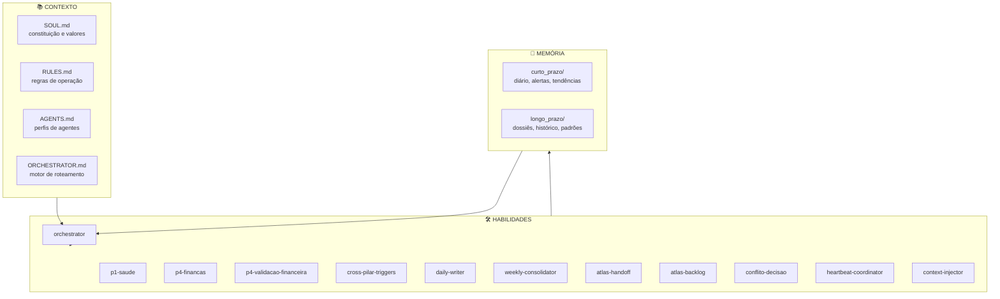

# Atlas — Sistema Cognitivo Multi-Agente

> Um copiloto pessoal que lembra, coordena e age através de agentes especializados, com memória persistente em Markdown.

---

## O problema

Modelos de linguagem esquecem o contexto a cada nova conversa. Agentes isolados resolvem tarefas pontuais, mas não conversam entre si. Ferramentas de produtividade não entendem a vida do usuário como um sistema integrado.

O resultado: repetição, perda de insights e decisões tomadas sem memória do que realmente importa.

## A solução

**Atlas** é um sistema cognitivo pessoal construído em torno de três princípios:

1. **Memória persistente** — tudo vive em Markdown versionado no GitHub.
2. **Orquestração multi-agente** — um orchestrador central roteia decisões para agentes especializados.
3. **Vida organizada em pilares** — saúde, desenvolvimento, relações, finanças e propósito, cada um com sua própria skill.

## Arquitetura

## Habilidades ativas

| Skill | Função |
|---|---|
| `orchestrator` | Roteia interações, resolve conflitos cross-pilar e mantém o Kanban |
| `p1-saude` | Monitoramento de indicadores de saúde mental e física |
| `p4-financas` | Acompanhamento semanal de operações e decisões financeiras |
| `p4-validacao-financeira` | Validação de valores e transações acima de thresholds |
| `context-injector` | Prepara contexto antes de cada interação |
| `cross-pilar-triggers` | Motor de triggers que conecta eventos entre pilares |
| `heartbeat-coordinator` | Padrão anti-spam Check-Before-Act |
| `daily-writer` | Registro diário + commit automático |
| `weekly-consolidator` | Consolidado semanal dos 5 pilares |
| `atlas-handoff` | Processo de sincronização entre sessões |
| `atlas-backlog` | Gestão de tarefas e reconciliação com Kanban |
| `conflito-decisao` | Detecção de reversões e registro de ADRs |

## Demonstração

*(Screenshot da estrutura de pastas e exemplo de interação via Telegram serão adicionados aqui.)*

## Roadmap

- **Fase 1** — Pilares Saúde (P1) e Finanças (P4) operacionais.
- **Fase 2** — Ativação do pilar Desenvolvimento (P2) e portfólio comercial.
- **Fase 3** — Pilares Relações (P3) e Propósito (P5).
- **Futuro** — Empacotamento do Atlas como AIaaS para PMEs.

## Tecnologias e integrações

- Markdown + GitHub como base de memória persistente
- Hermes Agent como harness de execução
- Telegram como canal principal de interação
- GitHub Actions / cron para rotinas automáticas

## Sobre o autor

**Lucas Lemos** — contador em transição para desenvolvedor de agentes de IA. Construindo o Atlas como portfólio, laboratório e sistema pessoal de suporte estratégico.

- LinkedIn: *Lucas Lemos - www.linkedin.com/in/lucas-lemos-268294111*
- Email: *lucas.lml.altas@gmail.com*

---

*Este repositório é a versão pública de apresentação do projeto. A instância pessoal permanece privada por conter dados sensíveis.*
